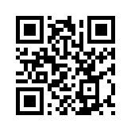

# Hackathon Poste (Rome, May 17th, 19th)

## How to get support ?
- Register your email on Webex Teams  https://teams.webex.com/signin
- [Optional] install Webex Teams App on your laptop or Mobile : https://www.ciscospark.com/downloads.html

- Join the Cisco Webex Teams Space for sharing Docs and chat with Mentors 

 
  
 

### Cisco Spark API Starter Guide

- Signin at https://developer.ciscospark.com with your Spark account credentials (same as the ones above) 
- Take the Rooms learning lab at DevNet - Cisco Developer Network: https://developer.ciscospark.com/samples-tutorials.html
- Experiment some Cisco Spark bots written in nodejs: https://github.com/ObjectIsAdvantag/sparkbot-webhook-samples
- POSTMAN collection for Cisco Spark API: https://bit.ly/POSTMAN-SPARK-API  
- Look for other Spark resources in various languages : https://github.com/CiscoDevNet/awesome-ciscospark

## Contents
We have created the following resources for you to quickly get started:
 - [Sign in Cisco Webex teams, Webex Dev Portal and Cisco DevNet](#wxteams-wxdev-devenet)
 - [Instructions to setup your environment](#setup-environment)
 - [Cisco Spark Starter Kit](#cisco-spark-starter-kit)
 
 
 ## Sign in Webex teams, Webex Dev Portal and Cisco DevNet
 
 
 ## Instructions to setup your environment:   
	
	**Complete the lab: (https://developer.cisco.com/learning/tracks/devnet-workshop-webex-appdev/devnet-express-collab-setup-sd/collab-dne-event-setup-sd/step/1)**

### Cisco Spark Bots
You can also create Spark Bots to automate routine tasks and inject contextual content into groups, meetings and conversations. 

### Cisco Spark Video
*[Check the widget samples](widgets/): paste your Cisco Spark access token and open each widget sample**

[Spark Widgets](https://developer.ciscospark.com/widgets.html): Integrate Spark functionality into your existing web apps with Widgets written in React
- Space Widget: Calling (Audio and video 1:1 calling) and Messaging (Space and 1:1 messaging, Markdown support, File sharing, Message flags and ability to delete messages, Read receipts, Persistent chat),
- Recents Widget: Recent Spark conversation list (spaces & people), Hooks to open a conversation with the Space Widget, Unread space highlighting, Event hooks for messages, calls, and memberships, Incoming call notifications

**[Take the Space Widget demo](https://code.s4d.io/widget-space/latest/demo/index.html)**

[Spark SDK for JS](https://developer.ciscospark.com/sdk-for-javascript.html): Integrate Cisco Spark calling into your JavaScript applications. Place and receive video calls via the SDK: 
- Audio and/or video 1:1 calling,
- Dial by email or SIP address,
- Call and event controls,
- Audio and video call control

[Spark SDK for iOS](https://developer.ciscospark.com/sdk-for-ios.html): Integrate Cisco Spark calling into your iOS apps. Place and receive Spark video calls: 
- Audio and/or video 1:1 calling, 
- Dial by email, Spark User ID, or SIP address,
- Call and event controls, including DTMF
- Audio and video call control

Learning lab: “Embedding Video into existing applications” 
https://developer.cisco.com/learning/tracks/collab-cloud/creating-spark-integrations-sd/collab-spark-video-widget-meet/step/1 

