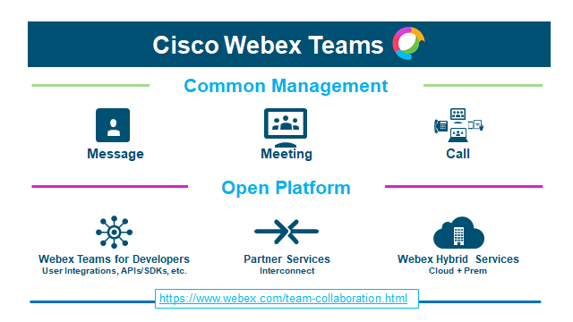
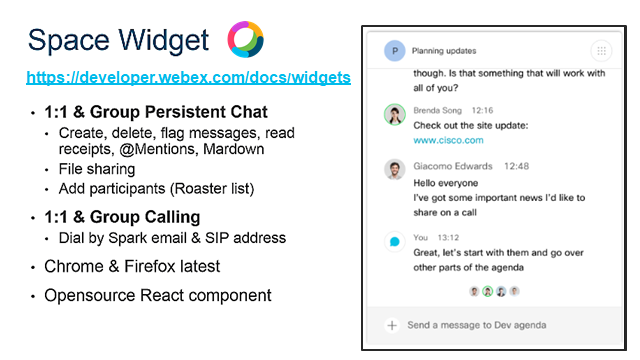

# Hackathon Poste (Rome, May 17th-19th)

Welcome to the Cisco Technical Resources repo for Poste Hackhaton 8, a curated list of developer resources to quickly get started with Cisco technologies and APIs:

- Sign up for [Cisco Webex](https://www.webex.com/) and reach to [Cisco Webex Teams Web client](https://teams.webex.com/signin)
- [optional] [Install a Webex Teams client](https://www.ciscospark.com/downloads.html) on your laptop and/or mobile phone, and get instant access from all your devices

- **Register at [Cisco DevNet](https://developer.cisco.com)**

- Sign in at [Webex for Developers](https://developer.webex.com) with your Webex Teams account credentials (same as the ones above). This is where you'll get your API access token.
 
**For getting support**
- Join the Cisco Webex Teams Space for sharing Docs, enter your email and start chatting with Mentors: (https://eurl.io/#rkjotUehV)
 
 - Webex Teams API support is freely accessible 24/24, 7/7, via [email and #webex4devs room](https://dev-preview.webex.com/support.html)

 
## Cisco Webex Teams Starter Kit

**Background info: Cisco Webex Teams free plan gives you Chating, Audio & Video calls to other Webex Teams users, and meetings with up to 3 members (Chat, Video, Shared-board)**

- Signin at https://developer.webex.com with your Webex Teams account credentials (same as the ones above)
- Take the  [Cisco Webex Teams Learning Track](https://learninglabs.cisco.com/tracks/collab-cloud) to learn to automate Cisco Webex Teams and create Cisco Webex Teams Applications (bots, OAUTH integrations).

**Few learning resources**
- Leverage POSTMAN collection for Cisco Webex Teams API: http://bit.ly/postman-webex 
- Experiment some Cisco Webex Teams bots written in nodejs: https://github.com/CiscoDevNet/node-sparkbot-samples
- Look for other Webex Teams resources in various languages: https://github.com/CiscoDevNet/awesome-webex to get code samples and SDKs in various programming languages
 
**For preparing your environment**
- Follow the instructions and Complete the lab: https://developer.cisco.com/learning/tracks/devnet-workshop-webex-appdev/devnet-express-collab-setup-sd/collab-dne-event-setup-sd/step/1
 

## Creating Chat Bots
- Take the [Create Cisco Webex Teams bots](https://developer.webex.com/docs/bots) tutorial and [get inspired from several BotKit samples](https://github.com/CiscoDevNet/botkit-webex-samples) in nodeJS
- Don't miss the existing [Cisco Webex Teams Starter Kits](https://ciscowebexteamsambassadors.github.io/StarterKits/) to quickly create chat bots.
 
 
 
## Embedding Video Calls

**[Check the widget code samples](https://github.com/CiscoDevNet/widget-samples): paste your Cisco Webex Teams  access token and the ready-to-use widget samples**
[Webex Teams  Widgets](https://developer.ciscospark.com/widgets.html): Integrate Webex Teams functionality into your existing web apps with Widgets written in React
- Space Widget: Calling (Audio and video 1:1 calling) and Messaging (Space and 1:1 messaging, Markdown support, File sharing, Message flags and ability to delete messages, Read receipts, Persistent chat),
- Recents Widget: Recent Webex Teams  conversation list (spaces & people), Hooks to open a conversation with the Space Widget, Unread space highlighting, Event hooks for messages, calls, and memberships, Incoming call notifications

**[Take the Space Widget quick start](https://developer.webex.com/docs/widgets)**

[Webex Teams SDK for Browser](https://developer.webex.com/docs/sdks/browser): Integrate Cisco Webex Teams calling into your JavaScript applications. Place and receive video calls via the SDK: 
- Audio/Video calls (Group and 1-1)
- Dial by email or SIP address
- Call and event controls 
- Maximum bandwidth controls new
- View shared content
- Share screen and application from Firefox 
- Supported on Chrome and Firefox latest versions
 
[Webex Teams  SDK for iOS](https://developer.webex.com/docs/sdks/ios): Integrate Cisco Webex Teams  calling into your iOS apps. Place and receive Webex Teams  video calls: 
- Audio/Video calls (Group and 1-1)
- Group space calling
- Dial by email, Webex Teams User ID, or SIP address
- Call and event controls, including DTMF
- Audio and video call control
- View content and video simultaneously
- iOS 11 support
- Maximum bandwidth controls
- Receive and share content
- Message securely
- Group call with multistream view 

[Webex Teams  SDK for Android](https://developer.ciscospark.com/sdk-for-android.html): Integrate Cisco Webex Teams  calling into your Android apps. Place and receive Webex Teams  video calls: 
- Audio and/or video 1:1 calling
- Group space calling
- Dial by email, Webex Teams User ID, or SIP address
- Call and event controls, including DTMF
- Supported on Chrome and Firefox latest versions
- Audio and video call control
- View content and video simultaneously
- Maximum bandwidth controls
- Create Teams, Spaces, Memberships, and Messages
- Receive and share content
- Message securely
- Group call with multistream view

**Webex Teams SDK Features Comparison**

